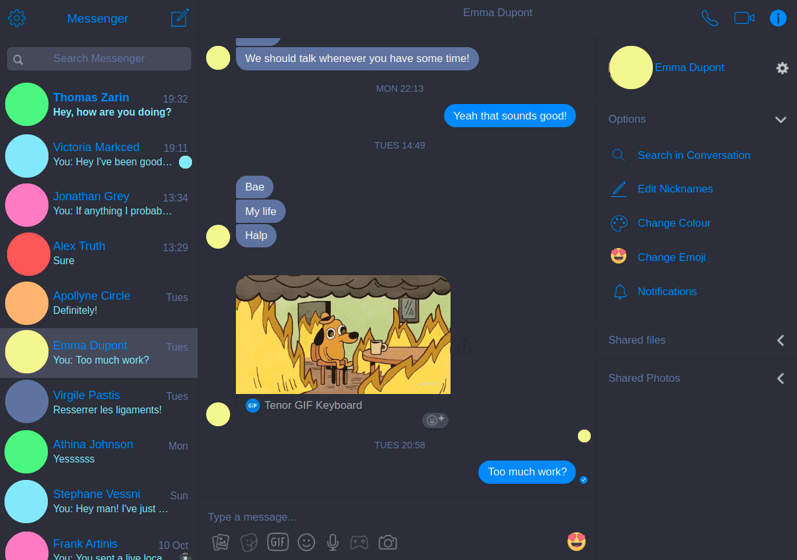

# Dracula for [Facebook Messenger](https://www.messenger.com/)

> A dark theme for [Facebook Messenger](https://www.messenger.com/)



## Install

All instructions can be found at [draculatheme.com/facebook-messenger](https://draculatheme.com/facebook-messenger).

## Development

To run this project you will need [Sass](http://sass-lang.com/) which can be installed with `npm i -g node-sass`

I recommend using [node-sass](https://github.com/sass/node-sass) which can be run as follows:

```
node-sass --watch --source-map-contents src/sass --output src/css
```

For a better experience working on this project, we recommend that you have the **EditorConfig** extension installed on their [Github](https://github.com/editorconfig) in their editor, you can find the correct extension for your editor .

If running chrome open up your browser and enter [chrome://extensions](chrome://extensions) into the address bar. Otherwise click on settings, more tools, extensions. Toggle **developer mode**, click on **load unpacked** and select **fb-messenger**.

## Team

This theme is maintained by the following person(s) and a bunch of [awesome contributors](https://github.com/dracula/fb-messenger/graphs/contributors).

| [](https://github.com/ppartarr) |
| ------------------------------------------------------------------------------------------------------------------ |
| [Philippe Partarrieu](https://github.com/ppartarr)                                                                 |

## Community

* [Twitter](https://twitter.com/draculatheme) - Best for getting updates about themes and new stuff.
* [GitHub](https://github.com/dracula/dracula-theme/discussions) - Best for asking questions and discussing issues.
* [Discord](https://draculatheme.com/discord-invite) - Best for hanging out with the community.

## Contributing

Feel free to help me develop this extension by submitting pull requests! You can view a list of contributors [here](https://github.com/dracula/fb-messenger/graphs/contributors)

## Questions

If you have an problems getting something to work please email me at <philippe@partarrieu.me> or file a [Github Issue](https://github.com/dracula/fb-messenger/issues)

## License

This extension is free and open source software, distributed under the The MIT License.
